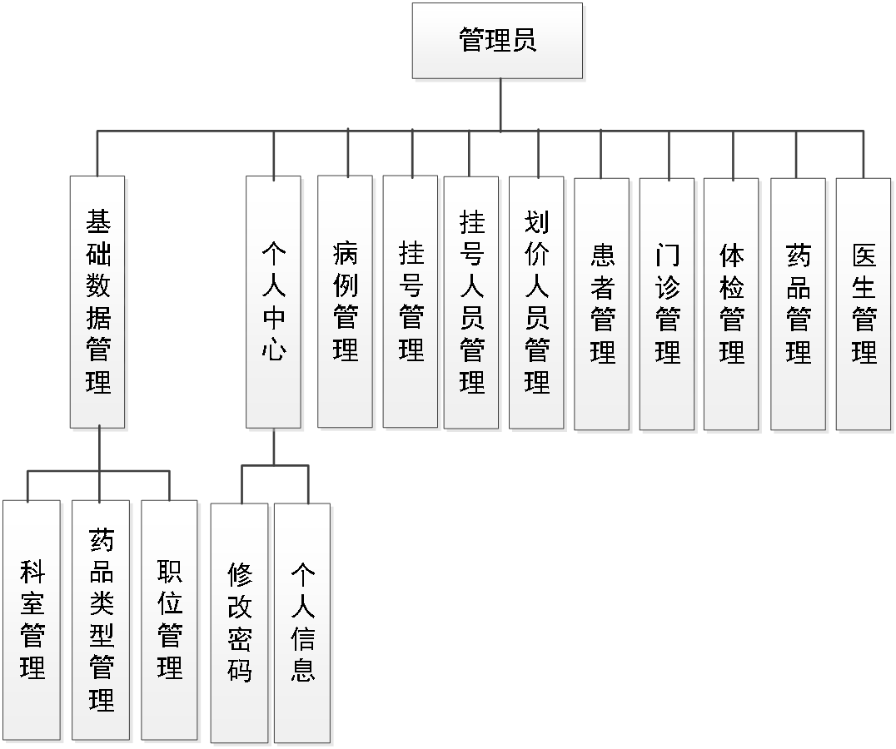
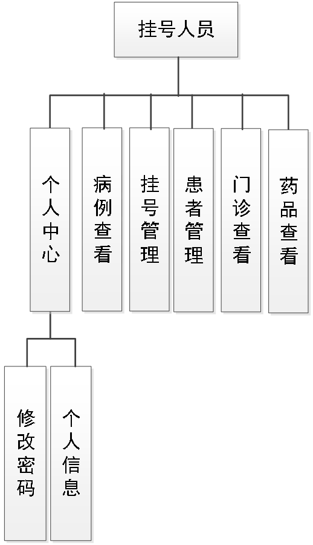
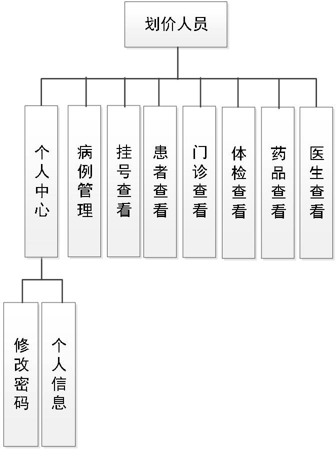
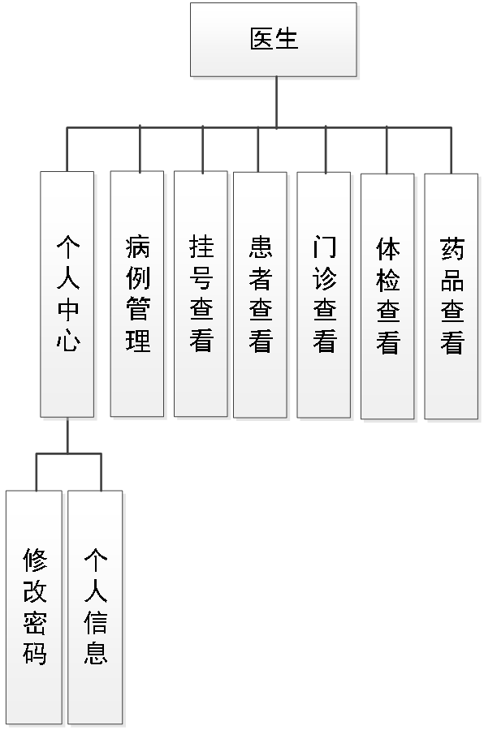
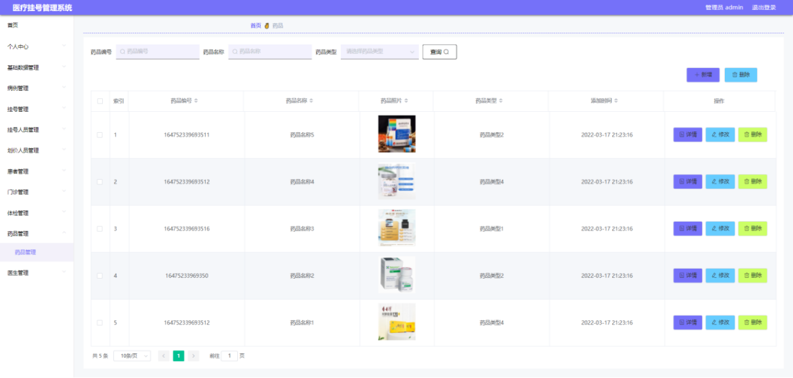
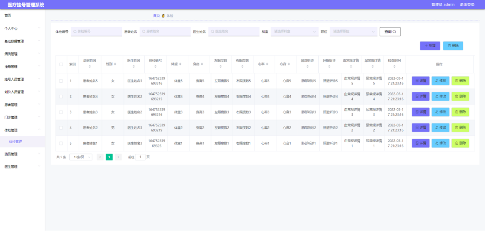
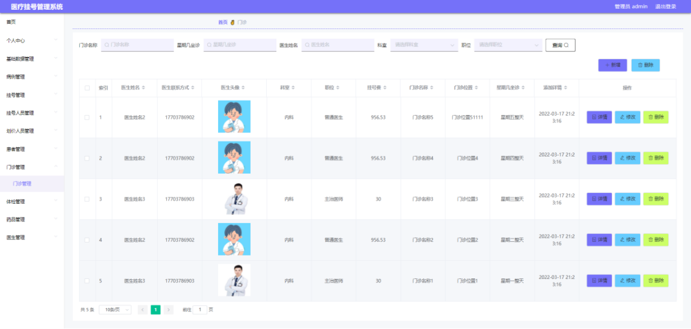
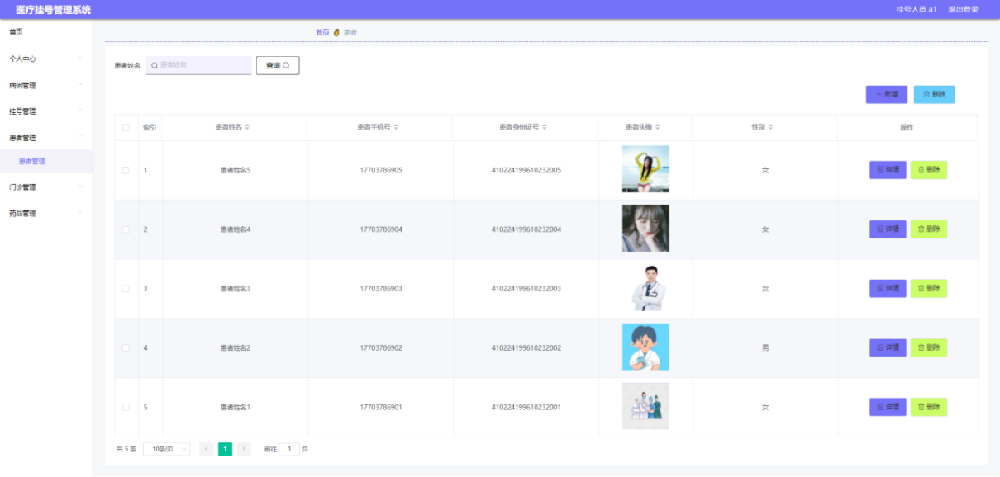
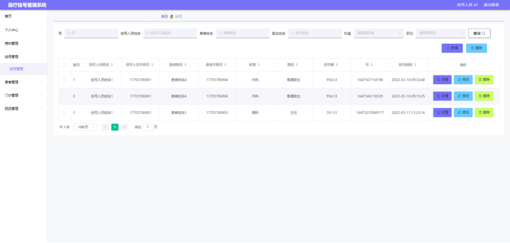
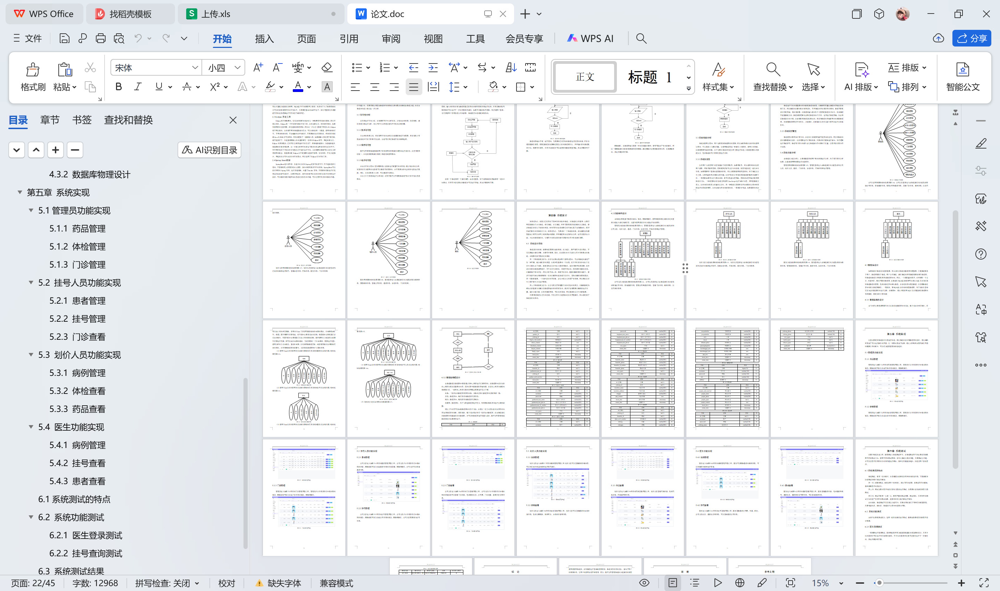

# springboot105-基于SpringBoot的医疗挂号管理系统

>  博主介绍：
>  Hey，我是程序员Chaers，一个专注于计算机领域的程序员
>  十年大厂程序员全栈开发‍ 日常分享项目经验 解决技术难题与技术推荐 承接各类网站设计，小程序开发，毕设等。
>  【计算机专业课程设计，毕业设计项目，Java，微信小程序，安卓APP都可以做，不仅仅是计算机专业，其它专业都可以】

## 3000套系统可挑选，获取链接：https://chaerspol.github.io/

<b>QQ【获取完整源码】：674456564</b>

<b>QQ群【获取完整源码】：1058861570</b>

### 系统架构

> 前端：html | js | css | jquery | vue
>
> 后端：springboot | mybatis
> 
> 环境：jdk1.8+ | mysql | maven

# 一、内容包括
包括有  项目源码+项目论文+数据库源码+答辩ppt+远程调试成功

# 二、运行环境

> jdk版本：1.8 及以上； ide工具：IDEA； 数据库: mysql5.7及以上；编程语言: Java

# 三、需求分析

**3.1可行性分析**

在项目进行开发之前，必须要有可行性分析报告，分别从技术角度，经济角度，操作角度上面进行分析，经过可行性分析是实现科学开发的必要步骤。

**3.1.1技术可行性**

从技术的角度出发，目前采用开发的技术完全能满足系统开发需要。目前市场上有现成的软件开发工具和开发技术，这些可以保证系统开发的顺利进展。

**3.1.2操作可行性**

医疗挂号管理系统是根据用户经常使用的页面操作流程来进行设计的，并且页面保证统一，从视觉角度和操作角度上都能达到使用要求。

**3.1.3经济可行性**

在本次开发过程中，因为需要通过电脑来进行配置开发的环境，通过对技术的分析，发现目前正在使用的电脑是可以满足开发需要的，并不需要太多的金钱对电脑进行更换。所以，从经济角度上分析，可以满足开发要求。
从以上三个角度来进行分析论证，证明了医疗挂号管理系统是可以正常开发并且使用的。

**3.2系统流程分析**

从系统的角色上分析，每个用户角色都代表了不同的账号身份，而不同的身份则代表着功能的异同，所以首先要区分用户的角色身份问题。设置用户登录需要输入账号和密码，输入的信息必须与数据库里已经存在的账号密码信息进行比对，只有正确的账号和密码才可以进行下一步的页面显示操作，如果不正确的账号密码，则拒绝用户登录，也代表着用户没有继续访问的权限，系统是无法继续提供服务的。

# 四、功能模块

本系统主要是基于数据的增加，修改，删除等操作，使用者能够通过提前设定的登录功能进入指定的操作区，这里对使用者设计的功能进行结构展示。
管理员功能结构图的绘制结果见下图。管理员登录进入本系统操作的功能包括对挂号人员，划价人员，患者，门诊信息，体检信息，药品信息等进行管理

挂号人员功能结构图的绘制结果见下图。挂号人员登录进入本系统操作的功能包括新增挂号信息，新增患者信息，管理挂号和患者信息，查看门诊信息，病例信息，以及药品信息等。

划价人员功能结构图的绘制结果见下图。划价人员登录进入本系统操作的功能包括为已划价的病例进行取药，查看体检信息，药品信息，医生信息，门诊信息等。

医生功能结构图的绘制结果见下图。医生登录进入本系统操作的功能包括添加病例信息，管理病例信息，查看挂号信息，患者信息，体检信息，门诊信息等

# 五、效果图展示【部分效果图】

图5-1 药品管理界面【管理员进入如图所示的药品管理界面之后，管理员点击信息显示栏中最右侧的修改，删除按钮可依次完成药品信息的修改，删除等操作】

图5-2 体检管理界面【管理员进入如图所示的体检管理界面之后，管理员点击信息显示栏中最右侧的修改，删除按钮可依次完成体检信息的修改，删除等操作】

图5-3 门诊管理界面【管理员进入如图所示的门诊管理界面之后，管理员点击信息显示栏中最右侧的修改，删除按钮可依次完成门诊信息的修改，删除等操作】

图5-4 患者管理界面【挂号人员进入如图所示的患者管理界面之后，挂号人员点击信息显示栏中最右侧的详情，删除按钮可依次完成患者信息的详情查看，删除等操作。挂号人员可以新增患者信息。】

图5-5 挂号管理界面【挂号人员进入如图所示的挂号管理界面之后，挂号人员点击信息显示栏中最右侧的修改，删除按钮可依次完成挂号信息的修改，删除等操作。挂号人员需要添加挂号信息。】

 <b>完整文章</b>
 
 
 

## 3000套系统可挑选，获取链接：https://chaerspol.github.io/

<b>QQ【获取完整源码】：674456564</b>

<b>QQ群【获取完整源码】：1058861570</b>

